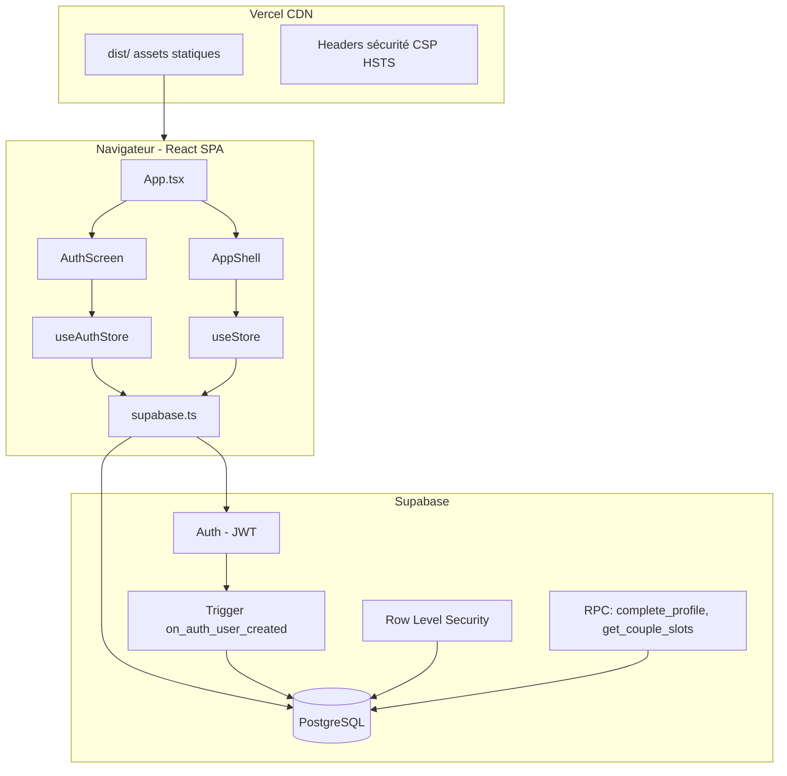

# E&M — Documentation technique complète

Application **mobile-first** de planification de vie sur **2 ans** pour un couple.  
Nom commercial : **E&M** (anciennement VisionDual).  
Dépôt GitHub : [kaemmanuel98-design/plan](https://github.com/kaemmanuel98-design/plan)  
Hébergement : **Vercel** (build Vite → dossier `dist/`).

Ce README documente **tout ce qui a été construit**, fichier par fichier, pour pouvoir diagnostiquer un problème sans repartir de zéro.

---

## Table des matières

1. [Vue d'ensemble](#1-vue-densemble)
2. [Architecture](#2-architecture)
3. [Stack technique](#3-stack-technique)
4. [Structure du projet](#4-structure-du-projet)
5. [Fonctionnalités détaillées](#5-fonctionnalités-détaillées)
6. [Authentification couple](#6-authentification-couple)
7. [Modèle de données](#7-modèle-de-données)
8. [État applicatif (Zustand)](#8-état-applicatif-zustand)
9. [Supabase — installation SQL](#9-supabase--installation-sql)
10. [Sécurité](#10-sécurité)
11. [Performance & fluidité](#11-performance--fluidité)
12. [Déploiement Vercel](#12-déploiement-vercel)
13. [Variables d'environnement](#13-variables-denvironnement)
14. [Design & identité visuelle](#14-design--identité-visuelle)
15. [Dépannage (guide de résolution)](#15-dépannage-guide-de-résolution)
16. [Historique des évolutions](#16-historique-des-évolutions)

---

## 1. Vue d'ensemble

### Concept

Trois **espaces** distincts :

| Code DB       | Interface | Qui y accède                          |
|---------------|-----------|---------------------------------------|
| `user_a`      | Monsieur  | Compte inscrit en tant que Monsieur   |
| `user_b`      | Madame    | Compte inscrit en tant que Madame     |
| `shared`      | Couple    | Les deux partenaires connectés        |

Chaque espace contient une **cascade d'objectifs** sur 8 niveaux, rattachés à l'un des **5 piliers de vie**.

### Modes de fonctionnement

| Mode            | Condition                                      | Comportement                                      |
|-----------------|------------------------------------------------|---------------------------------------------------|
| **Production**  | `VITE_SUPABASE_URL` + `VITE_SUPABASE_ANON_KEY` définis | Écran de connexion obligatoire, données dans Supabase |
| **Démo local**  | Pas de `.env` Supabase                         | Pas d'auth, données fictives en `localStorage`    |

> En production (Vercel), l'écran **Connexion / Inscription** s'affiche toujours tant qu'aucune session valide n'existe.

---

## 2. Architecture



### Flux utilisateur typique

1. Ouverture de l'app → `useAuthStore.init()` vérifie la session Supabase.
2. Si non connecté → `AuthScreen` (inscription ou connexion).
3. Si connecté → `AppShell` avec barre haute, contenu, navigation basse.
4. Les objectifs sont chargés via `useStore.loadGoals()` (filtrés par RLS côté serveur).
5. Toute modification locale est synchronisée vers Supabase (`insert` / `update` / `delete`).

---

## 3. Stack technique

| Couche        | Technologie              | Version (package.json) |
|---------------|--------------------------|-------------------------|
| UI            | React                    | 18.3                    |
| Langage       | TypeScript               | 5.6                     |
| Build         | Vite                     | 6.0                     |
| Styles        | Tailwind CSS             | 3.4                     |
| État          | Zustand + persist        | 5.0                     |
| Animations    | Framer Motion            | 11.15                   |
| Icônes        | Lucide React             | 0.469                   |
| Backend       | Supabase (Auth + Postgres)| 2.108                  |
| Célébrations  | canvas-confetti (lazy)   | 1.9                     |
| Hébergement   | Vercel                   | —                       |

### Scripts npm

```bash
npm install      # Installer les dépendances
npm run dev      # Dev local → http://localhost:5173
npm run build    # tsc -b && vite build → dist/
npm run preview  # Prévisualiser le build
```

---

## 4. Structure du projet

```
app_plan/
├── index.html              # Point d'entrée HTML, script anti-flash thème sombre
├── package.json
├── vite.config.ts          # Chunks manuels (vendor, motion, supabase, ui)
├── vercel.json             # Build, rewrites SPA, headers sécurité
├── tailwind.config.js
├── postcss.config.js
├── tsconfig*.json
├── .env.example            # Modèle variables Supabase
├── .gitignore              # .env, node_modules, dist, .netlify
│
├── public/
│   ├── favicon.svg
│   ├── apple-touch-icon.svg
│   ├── icon-192.svg
│   ├── icon-512.svg
│   ├── logo.svg
│   └── manifest.json       # PWA « E&M », portrait, standalone
│
├── supabase/
│   ├── schema.sql          # Schéma de base idempotent (NE PAS utiliser les anciennes policies)
│   ├── grants.sql          # Permissions finales — À exécuter en dernier
│   └── migrations/
│       ├── 001_recurrence.sql
│       ├── 002_vision_board.sql
│       ├── 003_auth_couple.sql
│       ├── 004_get_couple_slots.sql
│       ├── 005_signup_profile_trigger.sql
│       ├── 006_signup_fix_all.sql      # Script de secours inscription
│       └── 007_security_hardening.sql
│
└── src/
    ├── main.tsx            # Montage React
    ├── App.tsx             # Auth gate + lazy loading des vues
    ├── index.css           # Tokens design E&M / Anthropic-like
    │
    ├── types/
    │   ├── index.ts        # Goal, SpaceType, PillarId, GoalLevel, SWOT, SMART
    │   └── premium.ts      # AppView, ThemeMode, Recurrence, EncouragementPing
    │
    ├── data/
    │   └── pillars.ts      # 5 piliers : couleurs, icônes, labels
    │
    ├── hooks/
    │   └── useSpaceGoals.ts # Filtre objectifs par espace (useShallow)
    │
    ├── store/
    │   ├── useStore.ts     # Objectifs, wizard, sync Supabase
    │   ├── useAuthStore.ts # Session, profil, signIn/signUp/signOut
    │   ├── useThemeStore.ts# Clair / sombre / auto
    │   └── usePingStore.ts # Encouragements partenaire (localStorage)
    │
    ├── lib/
    │   ├── supabase.ts     # Client Supabase, CRUD goals
    │   ├── goalMapper.ts   # Conversion Goal ↔ ligne SQL
    │   ├── auth.ts         # Espaces autorisés, labels Monsieur/Madame
    │   ├── authErrors.ts   # Messages d'erreur auth en français
    │   ├── session.ts      # Contexte auth en mémoire (évite dépendance circulaire)
    │   ├── sanitize.ts     # Limites texte, validation email/mot de passe
    │   ├── imageUpload.ts  # Validation images (800 Ko max)
    │   ├── celebration.ts  # Confettis (import dynamique)
    │   ├── recurrence.ts   # Reset tâches récurrentes semaine/mois
    │   ├── focusDay.ts     # Logique Focus du jour
    │   ├── eisenhower.ts   # Matrice urgent/important
    │   ├── financeGauges.ts# Jauges pilier Finance
    │   ├── pillarEvolution.ts # Données graphique évolution
    │   ├── progress.ts     # Calcul % progression arbre
    │   ├── scheduleHealth.ts
    │   └── suggestions.ts  # Suggestions sous-tâches
    │
    └── components/
        ├── auth/AuthScreen.tsx
        ├── brand/EmLogo.tsx, AppIcons.tsx
        ├── layout/MobileTopBar, BottomNav, Fab, ...
        ├── dashboard/Dashboard, GoalTree, VisionHero, FinanceGauges, PillarEvolutionChart
        ├── focus/FocusDay.tsx
        ├── eisenhower/EisenhowerMatrix.tsx
        ├── vision/VisionBoard.tsx
        ├── wizard/VisionWizard.tsx
        ├── encouragement/EncourageButton, PingOverlay
        ├── ai/AiCoachPanel.tsx   # Placeholder Coach IA
        └── ui/...                  # Modal, SwotMatrix, ProgressBar, ThemeToggle, etc.
```

---

## 5. Fonctionnalités détaillées

### 5.1 Cascade d'objectifs (8 niveaux)

Ordre hiérarchique (`GOAL_LEVELS` dans `src/types/index.ts`) :

1. `global_vision` — Vision globale 2 ans (racine, `parent_id = null`)
2. `annual` — Annuel
3. `semester` — Semestriel
4. `quarterly` — Trimestriel
5. `monthly` — Mensuel
6. `weekly` — Hebdomadaire
7. `daily` — Quotidien
8. `time_block` — Créneau horaire (`startTime`, `endTime`)

**Composant principal** : `GoalTree.tsx` — arbre expandable, ajout manuel ou via suggestions.

### 5.2 Wizard vision globale

**Fichier** : `VisionWizard.tsx`  
**Déclencheur** : bouton FAB (`Fab.tsx`) sur la vue Accueil.

Étapes :
1. Titre, description, image vision board, choix du pilier
2. Matrice SWOT 4 quadrants (`SwotMatrix.tsx`)
3. Validation SMART (5 critères booléens)

À la soumission → `createVision()` dans `useStore` → `insertGoal` Supabase.

### 5.3 Vision Board

Image d'inspiration sur les visions globales.
- Colonne DB : `inspiration_image_url` (TEXT, data-URL base64)
- **Limite client** : 800 Ko, type `image/*` (`lib/imageUpload.ts`)
- **Limite DB** : 1 200 000 caractères (migration 007)
- Composants : `VisionBoard.tsx`, intégré dans `VisionHero.tsx` et le wizard

### 5.4 Focus du Jour

**Vue** : `currentView === 'focus'` → `FocusDay.tsx`  
Affiche les actions du jour filtrées par espace courant (`lib/focusDay.ts`).

### 5.5 Matrice Eisenhower

**Vue** : `currentView === 'eisenhower'` → `EisenhowerMatrix.tsx`  
Classe les tâches non terminées en 4 quadrants (`lib/eisenhower.ts`).

### 5.6 Premium — Récurrence

Tâches `weekly` ou `monthly` qui se réinitialisent automatiquement.
- Colonnes : `recurrence`, `recurrence_completed_at`
- Logique : `lib/recurrence.ts`, intervalle de vérification 60 s dans `App.tsx`

### 5.7 Jauges Finance & graphique pilier

- `FinanceGauges.tsx` + `lib/financeGauges.ts` — progression pilier `financier`
- `PillarEvolutionChart.tsx` + `lib/pillarEvolution.ts` — courbe d'évolution

### 5.8 Pings d'encouragement

Quand un partenaire complète une tâche quotidienne/hebdo dans son espace privé, un ping est enregistré pour l'autre.
- **Stockage** : `localStorage` uniquement (`usePingStore`, clé `visiondual-pings`)
- **Non synchronisé** entre appareils (limitation connue)
- UI : `EncourageButton.tsx`, `PingOverlay.tsx`

### 5.9 Coach IA

`AiCoachPanel.tsx` — panneau placeholder (pas d'appel API réel configuré).

### 5.10 Thème

`useThemeStore.ts` — modes `light` | `dark` | `auto`  
- Clé localStorage : `visiondual-theme`
- `auto` : sombre si préférence système OU entre 19h et 7h
- Script inline dans `index.html` évite le flash blanc au chargement

### 5.11 Célébrations

`celebrateMajorGoal()` déclenché quand on complète :
- une vision globale ou annuelle
- un objectif trimestriel dans l'espace Couple

Confettis chargés **à la demande** (chunk séparé ~11 Ko).

---

## 6. Authentification couple

### 6.1 Règles métier

- **Maximum 2 comptes** par instance (1 Monsieur + 1 Madame)
- Chaque compte est lié à un `couple_id` partagé (table `couples`)
- Le rôle (`space_type`) est **unique** : un seul `user_a`, un seul `user_b`
- L'espace `shared` n'a pas de compte dédié : accessible aux deux

### 6.2 Matrice d'accès

| Profil connecté | Espaces visibles dans la barre du bas |
|-----------------|---------------------------------------|
| `user_a`        | Monsieur + Couple                     |
| `user_b`        | Madame + Couple                       |

Implémentation :
- `lib/auth.ts` → `getAllowedSpaces()`, `isSpaceAllowed()`
- `BottomNav.tsx` → onglet partenaire grisé (`opacity-25`, `disabled`)
- `useStore.setCurrentSpace()` → refuse le changement si non autorisé
- PostgreSQL RLS → `can_access_goal_space()` filtre les lignes `goals`

### 6.3 Flux d'inscription

```
AuthScreen (signup)
  → supabase.auth.signUp({ email, password, options: { data: { display_name, space_type } } })
  → Trigger SQL on_auth_user_created sur auth.users
  → complete_profile_for_user() crée la ligne profiles
  → Si session immédiate : setSession + ensureProfileFromSession + loadGoals
  → Si confirmation email requise : message vert, l'utilisateur se connecte après
```

**Fichiers clés** :
- `src/components/auth/AuthScreen.tsx`
- `src/store/useAuthStore.ts`
- `supabase/migrations/005_signup_profile_trigger.sql`

### 6.4 Flux de connexion

```
AuthScreen (login)
  → signInWithPassword
  → ensureProfileFromSession (fetch profil ou RPC complete_profile si manquant)
  → loadGoals
```

### 6.5 RPC Supabase utilisées par le client

| RPC                  | Rôle                                              | Qui peut appeler   |
|----------------------|---------------------------------------------------|--------------------|
| `get_couple_slots()` | Savoir si Monsieur/Madame est déjà pris (inscription) | `anon`, `authenticated` |
| `complete_profile()` | Créer profil si trigger a échoué                  | `authenticated`    |

### 6.6 Validation côté client (inscription)

- Email : regex basique (`lib/sanitize.ts`)
- Mot de passe : 8+ caractères, lettres + chiffres
- Messages d'erreur traduits : `lib/authErrors.ts` (rate limit Supabase, email déjà pris, etc.)

### 6.7 Déconnexion

Bouton dans `MobileTopBar.tsx` → `signOut()` → vide les objectifs en mémoire.

---

## 7. Modèle de données

### 7.1 Table `goals`

| Colonne                    | Type        | Description                          |
|----------------------------|-------------|--------------------------------------|
| `id`                       | UUID        | PK                                   |
| `parent_id`                | UUID        | FK vers parent (null si vision)      |
| `space_type`               | enum        | `user_a`, `user_b`, `shared`         |
| `level`                    | enum        | 8 niveaux (voir §5.1)                |
| `pillar_id`                | enum        | 5 piliers                            |
| `title`                    | TEXT        | max 200 car. (contrainte 007)        |
| `description`              | TEXT        | max 2000 car.                        |
| `completed`                | BOOLEAN     |                                      |
| `period_label`             | TEXT        | Libellé période                      |
| `start_time` / `end_time`  | TIME        | Time-blocking                        |
| `swot_*`                   | TEXT        | 4 champs SWOT                        |
| `smart_*`                  | BOOLEAN     | 5 critères SMART                     |
| `recurrence`               | TEXT        | `weekly` ou `monthly` (001)          |
| `recurrence_completed_at`  | TIMESTAMPTZ | (001)                                |
| `inspiration_image_url`    | TEXT        | data-URL image (002)                 |
| `created_at` / `updated_at`| TIMESTAMPTZ | Trigger auto `updated_at`            |

### 7.2 Table `profiles`

| Colonne        | Type     | Description                    |
|----------------|----------|--------------------------------|
| `id`           | UUID     | = `auth.users.id`              |
| `display_name` | TEXT     | Prénom affiché                 |
| `space_type`   | enum     | `user_a` ou `user_b` (UNIQUE)  |
| `couple_id`    | UUID     | FK `couples` (003)             |
| `avatar_url`   | TEXT     | Non utilisé actuellement       |

### 7.3 Table `couples`

Regroupe les deux profils. Créée automatiquement au premier inscription.

### 7.4 Mapping TypeScript ↔ SQL

Fichier `src/lib/goalMapper.ts` :
- `rowToGoal()` — lecture
- `goalToRow()` — écriture

---

## 8. État applicatif (Zustand)

### 8.1 `useStore` — clé `visiondual-storage`

| Champ persisté     | Quand                          |
|--------------------|--------------------------------|
| `currentSpace`     | Toujours                       |
| `currentView`      | Toujours                       |
| `goals`            | **Uniquement** sans Supabase (démo) |

Champs en mémoire seulement (avec Supabase) : `goals`, `isLoading`, `isConnected`, `syncError`, `wizardOpen`, etc.

**Sync Supabase** :
- `loadGoals()` — au login et au montage `AppShell`
- `syncInsert` / `syncUpdate` / `deleteGoalFromDb` — après chaque mutation
- Timeout connexion : 10 secondes

### 8.2 `useAuthStore` — non persisté

| État            | Description                              |
|-----------------|------------------------------------------|
| `session`       | JWT Supabase                             |
| `profile`       | Profil `profiles`                        |
| `isLoading`     | true pendant init                        |
| `authError`     | Dernier message d'erreur                 |
| `signupNotice`  | Message succès inscription (email confirm) |
| `slots`         | `{ user_a, user_b }` occupés ou non     |

Listener `onAuthStateChange` : **un seul** enregistrement (garde module-level).

### 8.3 `useThemeStore` — clé `visiondual-theme`

`mode`: `light` | `dark` | `auto`

### 8.4 `usePingStore` — clé `visiondual-pings`

Liste de `EncouragementPing` en localStorage.

### 8.5 `lib/session.ts`

Stocke `{ hasSession, profileSpace }` en mémoire pour que `useStore` puisse vérifier les droits sans import circulaire.

---

## 9. Supabase — installation SQL

### 9.1 Ordre d'exécution (nouvelle base)

Exécuter dans **SQL Editor** Supabase, **dans cet ordre** :

| # | Fichier | Obligatoire | Rôle |
|---|---------|-------------|------|
| 1 | `supabase/schema.sql` | Oui | Tables, enums, index, trigger `updated_at` |
| 2 | `supabase/migrations/001_recurrence.sql` | Oui | Colonnes récurrence |
| 3 | `supabase/migrations/002_vision_board.sql` | Oui | Colonne image inspiration |
| 4 | `supabase/migrations/003_auth_couple.sql` | **Critique** | Auth couple, RLS, RPC `complete_profile` |
| 5 | `supabase/migrations/004_get_couple_slots.sql` | Oui | RPC slots inscription |
| 6 | `supabase/migrations/005_signup_profile_trigger.sql` | Oui | Trigger création profil auto |
| 7 | `supabase/migrations/007_security_hardening.sql` | **Critique** | Contraintes taille, RLS renforcée |
| 8 | `supabase/grants.sql` | Oui | Permissions finales |

> **006** (`006_signup_fix_all.sql`) : script **de secours** si l'inscription échoue. Peut remplacer 004+005 en une fois + répare les comptes orphelins.

### 9.2 Configuration Auth Supabase (Dashboard)

1. **Authentication → Providers → Email** : activé
2. **Confirm email** : **désactivé** recommandé (inscription immédiate)
3. **Authentication → URL Configuration** :
   - Site URL : `https://votre-app.vercel.app`
   - Redirect URLs : même URL + `http://localhost:5173` pour le dev
4. **Authentication → Rate limits** : laisser actifs (protection brute-force)

### 9.3 Vérifier que RLS est correct

```sql
-- Doit retourner authenticated_space_access, PAS user_a_access / user_b_access
SELECT policyname, cmd, qual
FROM pg_policies
WHERE tablename = 'goals';
```

Les anciennes policies `user_a_access` / `user_b_access` du `schema.sql` **laissaient tout utilisateur authentifié accéder à tous les espaces**. La migration 003+ les remplace.

### 9.4 Fonctions SQL importantes

| Fonction | Rôle |
|----------|------|
| `auth_user_space()` | Retourne le `space_type` du user connecté |
| `can_access_goal_space(goal_space)` | true si l'utilisateur peut voir/modifier cet espace |
| `complete_profile_for_user(uuid, name, space)` | Création profil (trigger + secours) |
| `complete_profile(name, space)` | Wrapper avec `auth.uid()` |
| `handle_new_user()` | Trigger AFTER INSERT sur `auth.users` |
| `get_couple_slots()` | JSON `{ user_a: bool, user_b: bool }` |

---

## 10. Sécurité

### 10.1 Couches de protection

```
┌─────────────────────────────────────────┐
│ Vercel headers (CSP, HSTS, X-Frame-Options) │
├─────────────────────────────────────────┤
│ Supabase Auth (JWT, rate limits)        │
├─────────────────────────────────────────┤
│ RLS PostgreSQL (filtrage par espace)    │
├─────────────────────────────────────────┤
│ Contraintes DB (tailles max)            │
├─────────────────────────────────────────┤
│ Validation client (sanitize, images)    │
└─────────────────────────────────────────┘
```

### 10.2 Headers Vercel (`vercel.json`)

| Header | Valeur / rôle |
|--------|----------------|
| `Content-Security-Policy` | Limite scripts, connexions (`*.supabase.co` uniquement) |
| `Strict-Transport-Security` | Force HTTPS 2 ans |
| `X-Frame-Options` | `DENY` — pas d'iframe (anti-clickjacking) |
| `X-Content-Type-Options` | `nosniff` |
| `Referrer-Policy` | `strict-origin-when-cross-origin` |
| `Permissions-Policy` | Désactive caméra, micro, géoloc |

### 10.3 Ce qui n'est PAS secret (normal)

- `VITE_SUPABASE_URL`
- `VITE_SUPABASE_ANON_KEY`

Ces clés sont **publiques** dans le bundle JS. La sécurité repose sur **RLS**, pas sur la dissimulation de la clé anon.

### 10.4 Ce qu'il ne faut JAMAIS mettre dans Vercel

- `service_role` key Supabase
- Tout secret serveur en préfixe `VITE_`

### 10.5 Limites de saisie (`lib/sanitize.ts`)

| Champ | Max |
|-------|-----|
| Titre | 200 |
| Description | 2000 |
| Champ SWOT | 1000 |
| Period label | 80 |
| Image (client) | 800 Ko |
| Image (DB) | ~1,2 Mo en base64 |

### 10.6 Accès révoqués (007 + grants)

- `anon` : **aucun** accès direct à `goals` ou `profiles`
- `goal_progress` (vue) : accès révoqué pour tous (évite contournement RLS)

---

## 11. Performance & fluidité

### 11.1 Code splitting (`App.tsx`)

Chargement paresseux (`React.lazy`) :
- `Dashboard`, `FocusDay`, `EisenhowerMatrix`
- `VisionWizard`, `EncourageButton`, `PingOverlay`
- `canvas-confetti` via import dynamique dans `celebration.ts`

### 11.2 Chunks Vite (`vite.config.ts`)

| Chunk | Contenu |
|-------|---------|
| `vendor` | react, react-dom |
| `motion` | framer-motion |
| `supabase` | @supabase/supabase-js |
| `ui` | lucide-react, zustand |

Bundle initial ~42 Ko gzip (hors chunks lazy).

### 11.3 Optimisations rendu

- `useSpaceGoals` : sélecteur `useShallow` pour limiter re-renders
- Listener auth unique (pas de double `loadGoals`)
- Cache assets Vercel : 1 an sur `/assets/*`

---

## 12. Déploiement Vercel

### 12.1 Connexion repo

1. [vercel.com](https://vercel.com) → Import GitHub → `kaemmanuel98-design/plan`
2. Framework détecté : **Vite** (via `vercel.json`)

### 12.2 Paramètres build

| Paramètre | Valeur |
|-----------|--------|
| Build Command | `npm run build` |
| Output Directory | `dist` |
| Install Command | `npm install` |

### 12.3 Variables d'environnement

Voir [§13](#13-variables-denvironnement).  
**Après ajout/modification** : redéployer (Redeploy, idéalement clear cache).

### 12.4 Push → déploiement auto

```bash
git add .
git commit -m "message"
git push origin main
```

### 12.5 Git — piège évité

Ne pas avoir un sous-dossier `plan/` avec son propre `.git` vide à l'intérieur du projet : cela provoque l'erreur `'plan/' does not have a commit checked out` au `git add`.

---

## 13. Variables d'environnement

### Fichier local `.env` (copier depuis `.env.example`)

```env
VITE_SUPABASE_URL=https://xxxxxxxx.supabase.co
VITE_SUPABASE_ANON_KEY=eyJhbGciOiJIUzI1NiIsInR5cCI6IkpXVCJ9...
```

**Où les trouver** : Supabase → Project Settings → API → Project URL + `anon` `public` key.

### Vercel

Project → Settings → Environment Variables → cocher Production + Preview + Development.

---

## 14. Design & identité visuelle

### 14.1 Marque E&M

- Logo : `EmLogo.tsx` + `public/logo.svg`
- Fond crème, typo **Newsreader** (italique pour le `&` terracotta)
- Favicon / PWA : `public/favicon.svg`, `icon-192.svg`, `icon-512.svg`

### 14.2 Tokens CSS (`index.css`)

Préfixe `--aw-*` (style inspiré Anthropic) :
- `--aw-bg`, `--aw-warm`, `--aw-accent`, `--aw-line`, `--aw-faint`, etc.
- Classes utilitaires : `.mobile-shell`, `.mobile-container`, `.btn-primary`, `.input-field`, `.tab-bar`

### 14.3 Navigation mobile

- **Haut** (`MobileTopBar`) : logo, 3 vues (Accueil / Focus / Eisenhower), espace courant, déconnexion, thème
- **Bas** (`BottomNav`) : 3 icônes espaces (Monsieur / Couple / Madame)
- **FAB** : nouvelle vision (vue Accueil uniquement)

### 14.4 Icônes personnalisées

`AppIcons.tsx` : `IconMonsieur`, `IconMadame`, `IconCouple`, `IconHome`, `IconFocus`, `IconMatrix`

---

## 15. Dépannage (guide de résolution)

### Auth & inscription

| Symptôme | Cause probable | Solution |
|----------|----------------|----------|
| Pas d'écran de connexion | Variables Supabase absentes sur Vercel | Ajouter `VITE_*`, redéployer |
| Bannière « Supabase non configuré » | Idem | Idem |
| `Non authentifié` à l'inscription | Ancien code appelait RPC sans session | Exécuter 005/006, redéployer le code actuel |
| `Profil non créé` | Trigger absent ou `couple_id` manquant | Exécuter `006_signup_fix_all.sql` |
| `only request this after X seconds` | Rate limit Supabase | Attendre 1 min, ne pas spammer inscription |
| `Cet e-mail est déjà utilisé` | Compte auth existe sans profil | Exécuter 006 (réparation), puis **Connexion** |
| `Ce rôle est déjà pris` | Monsieur ou Madame déjà inscrit | Choisir l'autre rôle ou se connecter |
| `Ce couple est complet` | 2 profils existent | Connexion uniquement, pas d'inscription |
| `Profil introuvable` après login | Pas de ligne `profiles` | Exécuter 006, vérifier métadonnées `space_type` dans auth.users |
| E-mail jamais reçu | Confirm email activé | Désactiver dans Supabase Auth |

### Données & sync

| Symptôme | Cause probable | Solution |
|----------|----------------|----------|
| Point orange / pas connecté | RLS bloque ou mauvaises clés | Vérifier 003+007+grants, clés Vercel |
| `Délai de connexion dépassé` | Réseau ou Supabase down | Vérifier URL projet, status Supabase |
| Objectifs visibles de l'autre espace | Anciennes policies RLS | Exécuter 003 et 007 |
| Erreur insert titre long | Contrainte 007 | Titre ≤ 200 caractères |
| Image ne s'enregistre pas | > 800 Ko ou mauvais type | Réduire l'image |
| Données disparaissent au refresh | Pas connecté, mode démo | Configurer Supabase |

### Déploiement & Git

| Symptôme | Cause probable | Solution |
|----------|----------------|----------|
| `plan/ does not have a commit checked out` | Sous-repo git vide dans `plan/` | Supprimer `plan/.git` ou tout le dossier `plan/` |
| `Repository not found` | URL remote incorrecte | `git remote set-url origin https://github.com/kaemmanuel98-design/plan.git` |
| Build Vercel échoue | Erreur TypeScript | `npm run build` en local, corriger |
| CSP bloque Supabase | Mauvais domaine | Vérifier que l'URL projet est bien `*.supabase.co` |

### Requêtes SQL de diagnostic

```sql
-- Profils existants
SELECT id, display_name, space_type, couple_id FROM profiles;

-- Utilisateurs auth sans profil
SELECT u.id, u.email, u.raw_user_meta_data
FROM auth.users u
LEFT JOIN profiles p ON p.id = u.id
WHERE p.id IS NULL;

-- Policies actives sur goals
SELECT * FROM pg_policies WHERE tablename = 'goals';

-- Slots disponibles
SELECT get_couple_slots();
```

### Réinitialisation complète auth (⚠️ destructif)

```sql
-- Supprimer toutes les données couple (ATTENTION)
DELETE FROM goals;
DELETE FROM profiles;
DELETE FROM couples;
-- Puis supprimer les users dans Authentication → Users (Dashboard)
```

---

## 16. Historique des évolutions

| Phase | Ce qui a été fait |
|-------|-------------------|
| **Base** | App React/Vite, 3 espaces, cascade 8 niveaux, 5 piliers, SWOT/SMART wizard |
| **UI mobile** | Refonte mobile-first, barre haute/basse, peu de texte, style épuré |
| **Supabase** | Schéma PostgreSQL, sync objectifs, mode démo sans `.env` |
| **Premium** | Focus du jour, thème auto, jauges Finance, récurrence semaine/mois |
| **Graphiques** | Évolution pilier Finance (`PillarEvolutionChart`) |
| **SWOT** | Matrice 4 quadrants (`SwotMatrix`) |
| **Extensions** | Vision Board, pings encouragement, Eisenhower, Coach IA (placeholder) |
| **Rebrand E&M** | Logo Newsreader, favicon, icônes, manifest PWA |
| **Auth couple** | 2 comptes max, RLS par espace, `AuthScreen`, migrations 003–006 |
| **Déploiement** | GitHub `kaemmanuel98-design/plan`, Vercel, `vercel.json` |
| **Sécurité & perf** | Headers CSP, contraintes DB 007, lazy loading, chunks Vite, sanitisation |

### Commits Git principaux (référence)

```
b187bee Sécurité, performance et fluidité
f152ca0 Renforcer la création de profil à l'inscription
cdf74b2 Corriger l'inscription couple sans session active
4a55b2f Initial commit — app E&M
```

---

## Contacts & ressources

| Ressource | URL |
|-----------|-----|
| Code source | https://github.com/kaemmanuel98-design/plan |
| Supabase docs | https://supabase.com/docs |
| Vercel docs | https://vercel.com/docs |
| Dashboard Supabase | https://supabase.com/dashboard |
| Dashboard Vercel | https://vercel.com/dashboard |

---

*Dernière mise à jour documentation : juin 2026 — alignée sur l'état du dépôt `main`.*
